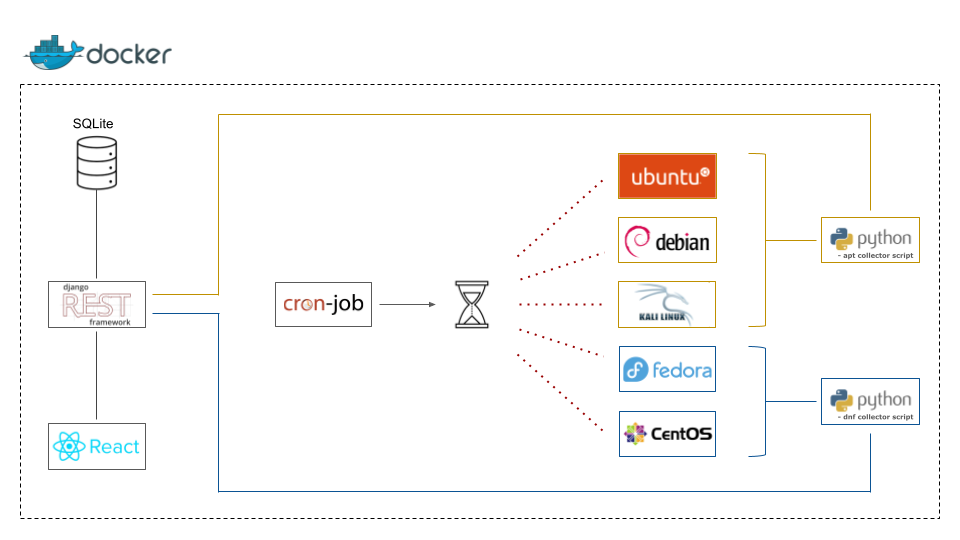

# PKGman
## Linux Packages Info Collection & Presentation

### Abstract:

“PKGman” is a web application that periodically collects a number of useful attributes about popular Linux
distributions’ software packages (e.g. name, available versions, size), stores them in a database
and also provides a website with search filters for their presentation.
The whole project consists of 3 distinguished parts: the mechanism (python scripts within Docker
containers) which extracts the information, the back-end (Django REST framework) which is
responsible for populating the database with the extracted attributes, querying it based on
specific search criteria and feeding the front-end with the corresponding results. The last part is
the front-end (React.js), whose role is to consume the queried results provided by the back-end
and present them in a well structured and intuitive way.
The end result is a web application that can benefit IT professionals and regular linux users alike.
A dev ops engineer will surely appreciate attributes such as package size and license, while a
simple user will definitely like the easy package searching and binary file (i.e. deb, rpm)
downloading via direct link. More than 240,000 software packages have been collected, in total.
The project currently supports Ubuntu 20.04, Debian 11, Kali 2021.4, Fedora 34 and CentOS
8.4.2105, but it can easily be extended to include even more distributions that utilize the apt or
dnf/yum package manager. The whole application is containerized and thus easily deployable via
a Docker-Compose file.
  



### Supported Linux Distributions:

- Ubuntu 20.04
- Debian 11
- Kali 2021.4
- Fedora 34
- CentOS 8.4.2105


### The collected package attributes are the following:
- name
- Linux distribution
- type [deb, rpm]
- category
- license
- maintainer
- description
- homepage website URL
- code repository URL


### For every package version the following attributes are also collected:
- name
- architecture
- size
- binary file URL

> <ins>Note:</ins> each package can have multiple versions


### How to run:

```
$ docker-compose up --build
```